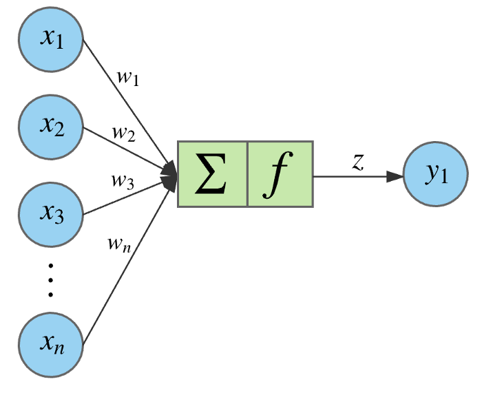

# Intro to Neural Networks

https://www.youtube.com/watch?v=aircAruvnKk

## General Structure of a Standard Neural Network

* image from https://towardsdatascience.com/designing-your-neural-networks-a5e4617027ed

Neural networks are made up of nodes that follow the structure shown below.

Each node performs an inner product between its inputs and weights, adds a bias, passes the value through an activation function, and outputs the result to the next layer in the network.

* images from https://towardsdatascience.com/applied-deep-learning-part-1-artificial-neural-networks-d7834f67a4f6

A neural network with two inputs and one node can separate data into classes.

output = f (w1 * x1 + w2 * x2 + b), where f (x) = 1 if x >= 10, 0 if x < 10

